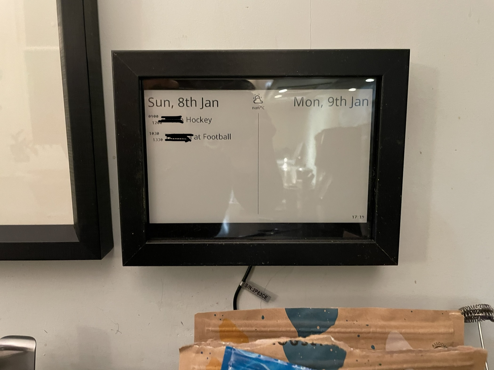
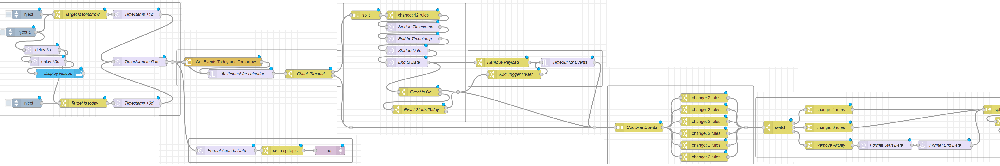
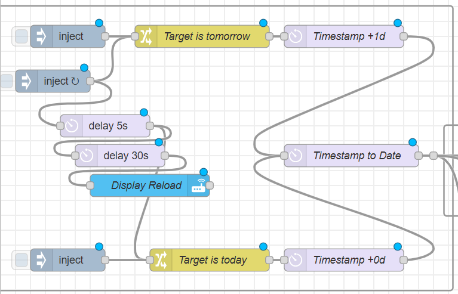
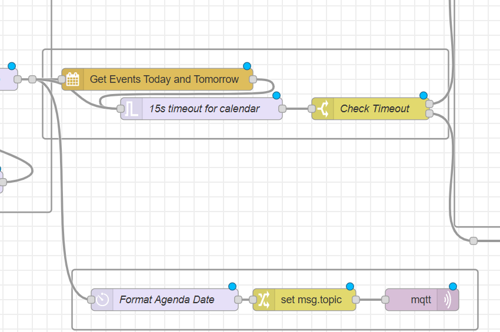
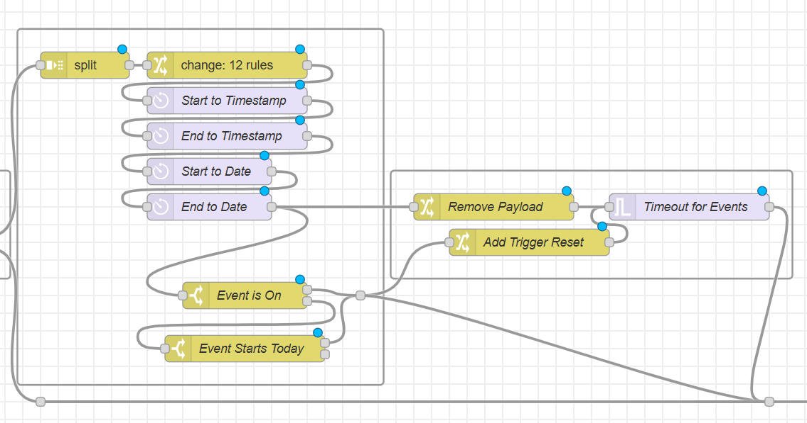
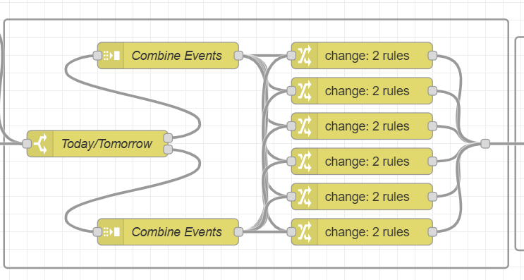
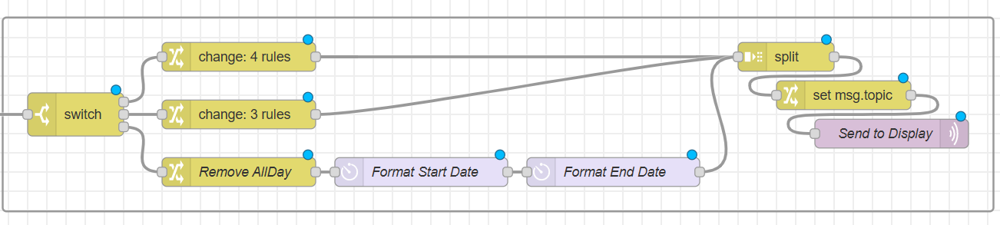

# Smart Family Calendar

A break down of my smart family calendar listing all the relevant parts and code. If you choose to follow behind me, good luck!



## Physical BOM

* [7.5" E-Paper Raw Panel - Laminated Glass](https://thepihut.com/products/7-5-e-paper-raw-panel-fully-laminated-800x480)
* [Universal e-Paper Raw Panel Driver Hat](https://thepihut.com/products/universal-e-paper-raw-panel-driver-hat)
* [Ikea Ribba Photo Frame 13x18](https://www.ikea.com/gb/en/p/ribba-frame-white-70378414/#content)

## Digital BOM

* [Home Assistant](https://www.home-assistant.io/)
* [espHome (as an HA add-on)](https://esphome.io/)
* [Node Red (as an HA add-on)](https://nodered.org/)
  * [For date processing - node-red-contrib-moment](https://flows.nodered.org/node/node-red-contrib-moment)
  * [For ical events - node-red-contrib-ical-events](https://flows.nodered.org/node/node-red-contrib-ical-events)
* [Mosquitto (as an HA add-on)](https://mosquitto.org/)

## Overall Design

1. Trigger the querying of the calendar
2. Get the events and handle timeouts
3. Process the events to identify those that are relevant for the day
4. Layout relevant events for the display
5. Publish the values to MQTT
6. Display updates with details



## Node-Red

### Triggering 



* Inject nodes allow manual update of a day or a scheduled run of both
* Start a delayed reload of the display
* Set the `msg.target` to `[today|tomorrow]`. This is important for managing timeouts later on
* Set the timestamp according to the flow

### Get Events



* Use a trigger node to add a timeout delay on the query
* Check if it was a timeout event or actual events in the payload
* Outputs payload array of calendar entries

### Event Processing



* Split the payload into individual items
* Strip a bunch of irrelevant attributes
* Create the timestamp and Date attributes
* Check if the event is on `msg.eventStart_timestamp < msg.timestamp > msg.eventEnd_timestamp`
* Then check if the date matches the relevant date `msg.eventStart_date == msg.timestamp_date || msg.eventEnd_date == msg.timestamp_date`
* The 'Timeout for Events' gives 5 seconds to identify any messages that are relevant. If not, then it sends a blank message so that the next stage sends all empty elements.

### Layout



* THe screen has 6 rows. 
* Move the payload[nth] to the payload for each of 6 rows. 
* If the array entry doesn't exist this creates an empty payload.

### Publish



* Switch 

## EspHome

The code for the display is [here](esphome/hall-epaper.yaml). The display subscribes to a set of MQTT messages representing each attribute for the 12 rows (6 today and 6 tomorrow)

### Code

```yaml
  - platform: mqtt_subscribe
    id: display_right
    internal: false
    name: "Display Right"
    entity_category: "diagnostic"
    topic: /calendar/tomorrow/date
```
This section creates the relevant display elements as diagnostic in HA. Useful for checking you are getting updates. 

TODO - add a `last_update`

```yaml
  - platform: mqtt_subscribe
    id: today_1_start
    internal: true
    topic: /calendar/today/0/eventStart
```
This is code for subscribing to each attribute.

```yaml
button:
  - platform: template
    name: Reload Display
    id: button_reload

    # Optional variables:
    icon: "mdi:sync"
    on_press:
      then:
        - logger.log: "Button pressed"
        - component.update: paper_screen
```
There is a button in HA to force the screen to redraw. This is used on the node-red flows.